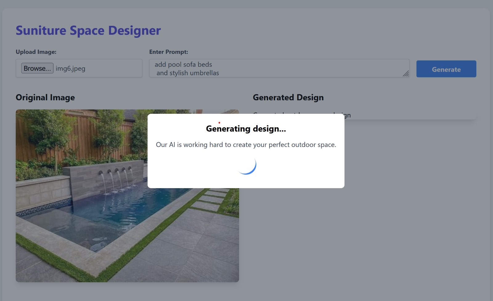
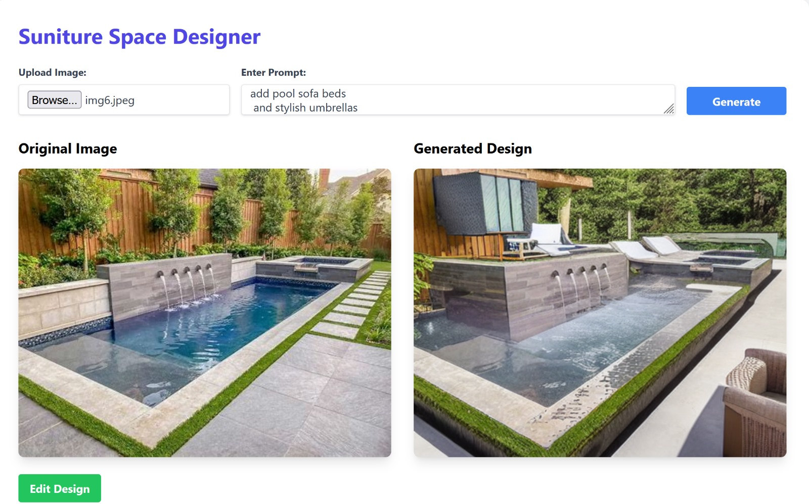

# transforming_space

Transforming space into timeless grace

## Overview

This project utilizes advanced AI models to enhance and transform images, creating visually stunning results.

### Image Segmentation

We employ the Segment Anything Model (SAM) from Meta AI to segment various areas of the image, such as grass, deck, pool, and more.

### Object Detection

For object detection, we utilize the YOLOv5 or YOLOv8 models. These models help identify and locate existing elements in the scene, such as trees and other objects.

### Image-to-Image Generation

Using Stable Diffusion, we can add new elements to the image based on specific prompts, enabling a rich creative process.

## Usage

1. **Image Segmentation**: Segment the image to identify different areas.
2. **Object Detection**: Detect and locate objects within the segmented areas.
3. **Image Generation**: Generate new content based on prompts and the existing scene.

## Contributing

Feel free to contribute to this project by submitting issues or pull requests. Your feedback and suggestions are welcome!

## License

This project is licensed under the MIT License - see the [LICENSE](LICENSE) file for details.
